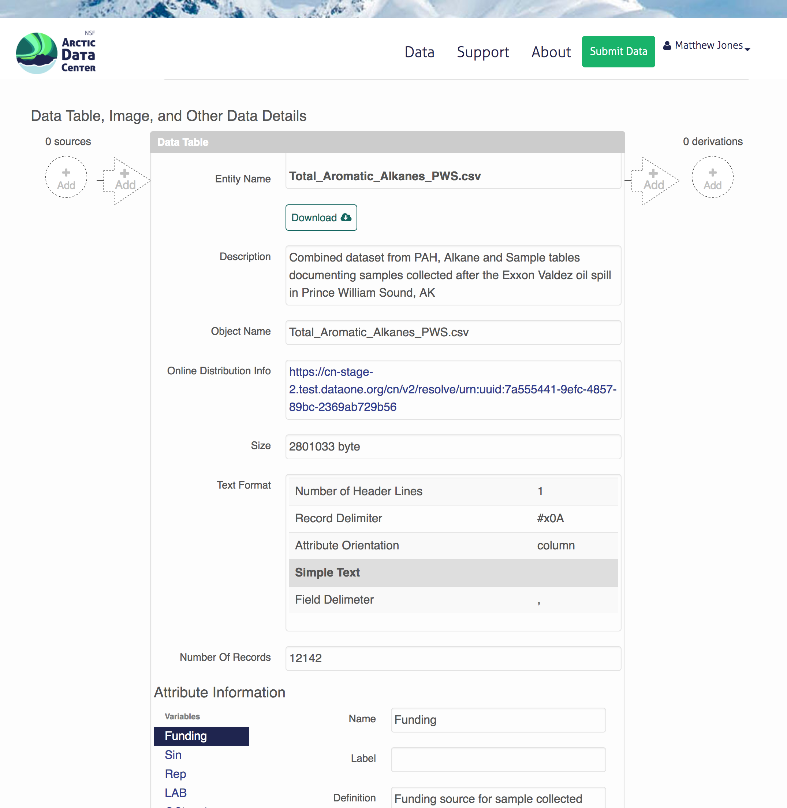
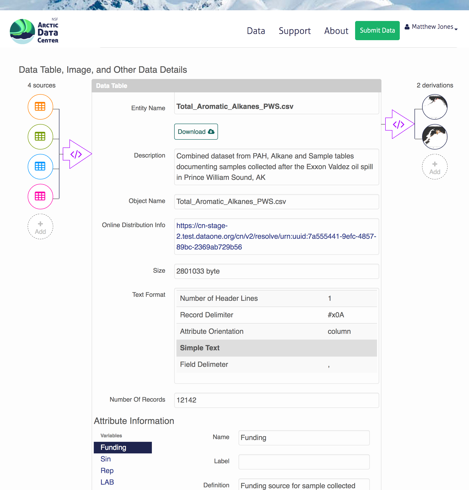

```{r setup, include=FALSE}
knitr::opts_chunk$set(echo = TRUE)
```

## Introduction
  
This document describes how to use the DataONE web-based provenance editor to
provide the linkages between input data files, scripts, and output data files 
that were used in an analysis.  Frequently, researchers produce derived data as
well as graphics, images, and maps as the result of multiple computational
processing steps. *Provenance* is the information that documents these relationships
to explicitly show how a derived product was created by running one or more
computational processes on a set of input data.

## Work-in-progress: Editing provenance from the browser

[DataONE](https://dataone.org) is developing a web-based provenance editor that enables
researchers to easily associate these provenance relationships with the data that they
upload to a DataONE data repsository.  Within the data landing page for a data set, the
data tables and other data items are listed, along with buttons for establishing which
*input* data were used, what *output products* were created, and which scripts were used
to habdle the processing.



## A DataONE Provenance display

After editing provenance, each of the inputs, outputs, ansd scripts is displayed
as an icon in the interface.



A real world example of a dataset with full provenance can be seen on the DataONE
search system:

[Mark Carls. 2017. Analysis of hydrocarbons following the Exxon Valdez oil spill, Gulf of Alaska, 1989 - 2014. urn:node:GOA. urn:uuid:3249ada0-afe3-4dd6-875e-0f7928a4c171.](https://search.dataone.org/#view/urn:uuid:3249ada0-afe3-4dd6-875e-0f7928a4c171)

## The ProvONE model

Provenance information in these records is represented using the [ProvONE model](), 
which is a formal specification of the relationships among the members of the federation.

## Tools in R for provenance

Tools like the R `datapack` and `dataone` libraries can be used to create this type of provenance
from within the R statistical language.

Jones M and Slaughter P (2017). _datapack: A Flexible Container to
Transport and Manipulate Data and Associated Resources_. doi:
10.5063/F1QV3JGM (URL: http://doi.org/10.5063/F1QV3JGM), R package
version 1.3.1, <URL: https://github.com/ropensci/datapack>.

Jones M, Slaughter P, Nahf R, Jones C, Boettiger C, Walker L, Hallett L,
Chamberlain S, Hart E and Read J (2017). _dataone: R Interface to the
DataONE REST API_. doi: 10.5063/F1M61H5X (URL:
http://doi.org/10.5063/F1M61H5X), R package version 2.1.0, <URL:
http://github.com/DataONEorg/rdataone>.

